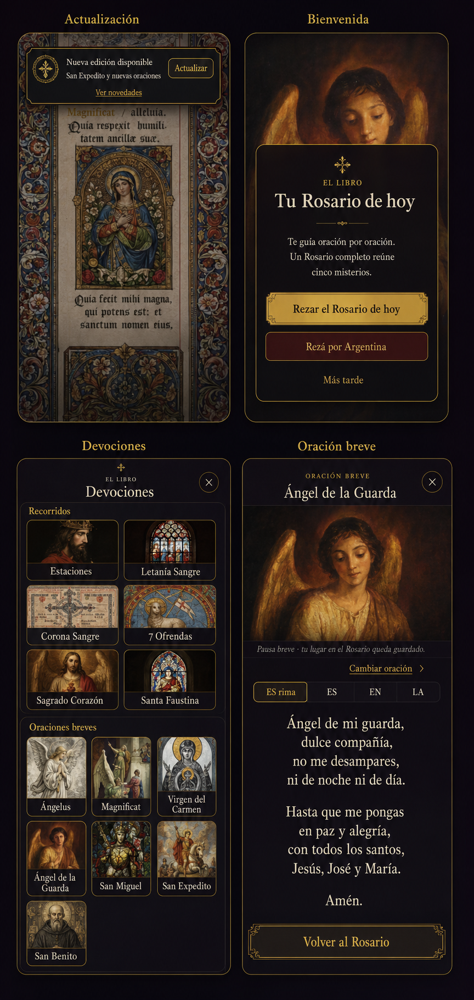

# Rosario Cards — superficies de bienvenida y devociones

**Estado:** listo para implementar  
**Objetivo:** `cloud-rosary-v2` · observado en `v0.3.64`  
**Alcance:** aviso de actualización, bienvenida, biblioteca de devociones y lector de oraciones breves.

## Referencia visual obligatoria



Esta imagen es el **objetivo de aceptación visual**, no una ilustración decorativa. Igualar de cerca composición, jerarquía, densidad, proporciones, tratamiento del arte, marcos dorados y contraste. Usar los assets reales del proyecto. Sólo apartarse por contenido dinámico, safe areas o accesibilidad, y comparar capturas lado a lado en `390×844` antes de cerrar.

## 0. Resultado buscado

Estas cuatro superficies deben sentirse como partes del mismo **libro de oración nocturno**: tinta oscura, marfil, filetes de oro, rojo profundo y arte sacro. No deben parecer banners, tarjetas SaaS ni una colección de botones agregados en distintas épocas.

La prioridad es siempre:

1. **Oración o decisión actual.**
2. Contexto breve.
3. Una acción primaria.
4. Navegación secundaria discreta.

## 1. Diagnóstico concreto

| Superficie | Archivo actual | Problema |
|---|---|---|
| Actualización | `src/components/Layout/AppShell.jsx` | Banner con estilos inline, demasiado ancho, texto y CTA compiten con el contenido; se superpone a la bienvenida. |
| Bienvenida | `src/components/Layout/AppShell.jsx` | Modal SaaS genérico: tres rectángulos de igual peso, radio excesivo y jerarquía débil. |
| Devociones | `DevotionsShelf.jsx/.css` + `BookletView.jsx` | Un tooltip de `22rem` intenta funcionar como biblioteca. Thumbs de 34–44 px, rótulos de ~9 px, badges crípticos y filas flex que desperdician ancho. |
| Oración breve | `OptionalPrayerSheet.jsx/.css` | Dos barras consecutivas de tabs aplastan títulos y texto. El selector de oración domina el lector aunque casi nunca se usa. |

No alcanza con agrandar lo existente. El problema es la **estructura de información**.

## 2. Lenguaje visual

### 2.1 Tokens

Centralizar en `:root`; no repetir hexadecimales ni introducir una librería.

| Token | Valor | Uso |
|---|---:|---|
| `--sacred-ink` | `#100c12` | fondo opaco |
| `--sacred-ink-glass` | `rgba(16, 12, 18, .94)` | sheets y avisos |
| `--sacred-ivory` | `#f4eddd` | texto principal |
| `--sacred-muted` | `#aaa092` | texto secundario; nunca menos de 12 px |
| `--sacred-gold` | `#d4af37` | foco, selección, filetes |
| `--sacred-gold-soft` | `rgba(212, 175, 55, .18)` | fondos activos |
| `--sacred-oxblood` | `#3a1118` | campaña / acento secundario |
| `--sacred-line` | `rgba(212, 175, 55, .34)` | bordes de 1 px |
| `--sacred-radius-sm` | `8px` | botones y tarjetas |
| `--sacred-radius-sheet` | `18px` | sheets, sólo esquinas exteriores |

Tipografía: conservar la serif del proyecto (Georgia fallback). Títulos con `text-wrap: balance`; cuerpo con `text-wrap: pretty`. Evitar mayúsculas corridas salvo cejas de 11–12 px con tracking.

### 2.2 Reglas

- El oro es **filete, foco y selección**. No llenar media pantalla de amarillo.
- Máximo una acción rellena o claramente dominante por superficie.
- Radio moderado; no convertir todo en píldoras.
- Arte sacro primero; badges con iniciales (`A`, `M`, `SM`, `H`) fuera. Fechas o cantidades sólo como texto útil (`16 jul`, `9 días`).
- Target táctil mínimo `44 × 44px`; foco visible de `2px`.
- Nada nuevo con estilos inline ni `!important`.

## 3. Aviso de actualización

Extraer a `src/components/common/UpdateNotice.jsx` y su CSS.

### 3.1 Forma

- Nota compacta flotante, no banner de página.
- Mobile: `position: fixed`, `top: calc(env(safe-area-inset-top) + 10px)`, `left/right: 12px`, `max-width: 420px`, centrada.
- Desktop: mismo ancho, alineada arriba a la derecha con margen de 16 px.
- Alto colapsado: `60–72px`; padding `10px 12px`; radio `10px`.
- Fondo tinta 96 %, filete oro, sombra sobria. Sin gradiente dorado.

### 3.2 Contenido

Una sola fila:

1. Ornamento pequeño `✦` o sello de 28 px.
2. Bloque flexible:
   - **Nueva edición disponible**
   - resumen de `getUpdateSummaryLine()` en una línea con ellipsis.
3. CTA compacto **Actualizar**: marfil sobre oro oscuro o tinta sobre oro; mínimo 44 px de alto.

Debajo, sólo si cabe, un enlace de texto **Ver novedades**. No subrayado permanente; sí foco/hover.

### 3.3 Prioridad de capas

- Nunca mostrarlo encima de bienvenida, ajustes, release notes, sync, feedback, compromiso u otra sheet/modal.
- Si llega una actualización mientras hay una capa bloqueante, conservar `updateAvailable` y mostrar la nota después de cerrarla.
- Z-order único: chrome `100`, aviso `600`, sheet `1200`, modal `1400`. Eliminar el `9999` de bienvenida.
- `applyPendingUpdate` y `setShowReleaseNotes(true)` no cambian.

## 4. Bienvenida

Extraer a `src/components/common/WelcomeSheet.jsx`. Mantener exactamente los callbacks y condiciones actuales.

### 4.1 Composición

- Backdrop fijo a `100dvh`, tinta 72 % y blur leve.
- Panel `min(92vw, 420px)`, radio 18 px, borde de 1 px. Padding `28px 22px 22px`.
- Un pequeño ornamento arriba, ceja **EL LIBRO**, título **Tu Rosario de hoy**.
- Cuerpo: “Te guía oración por oración. Un Rosario completo reúne cinco misterios.”
- Separador ornamental/filete antes de las acciones.

### 4.2 Acciones

1. **Rezar el Rosario de hoy** — acción primaria tipo portada: 52 px, oro sobrio, radio 8 px.
2. **Rezá por Argentina** — sólo durante campaña; fila secundaria sobre oxblood, borde oro tenue, 48 px.
3. **Más tarde** — botón de texto de 44 px, sin caja ni borde.

El texto “Ayuda (arriba)…” no merece una cuarta línea visual: retirarlo o integrarlo como `aria-description`. Un clic accidental dentro del panel no cierra; backdrop y `Escape` sí. Al abrir, foco en la acción primaria; al cerrar, devolver foco al disparador si existe.

## 5. Biblioteca de devociones

`DevotionsShelf` deja de ser tooltip y pasa a ser una **biblioteca en sheet**. Puede conservar el nombre/export para reducir churn.

### 5.1 Contenedor

- Mobile: bottom sheet fija, ancho completo, `max-height: min(82dvh, 720px)`, esquinas superiores de 18 px, respetando safe area y bottom nav.
- Desktop/tablet: panel de `min(92vw, 520px)`, centrado o anclado sobre la nav, máximo 720 px.
- Backdrop leve y cierre al tocar fuera / `Escape`.
- Header sticky: ceja **EL LIBRO**, título **Devociones**, subtítulo “Elegí un recorrido o una oración breve”, botón cerrar de 44 px.
- Un único cuerpo con scroll. No hacer scroll independiente por sección.

### 5.2 Recorridos

Renombrar el encabezado interno de “Devociones” a **Recorridos**.

- Grid de 2 columnas; gap 10 px.
- Tarjeta horizontal de mínimo 82 px: arte `54 × 66px` a la izquierda, título a la derecha, máximo dos líneas.
- `Estaciones` y `Sta. Faustina` tienen variantes. Al tocarlas, mostrar una elección contextual grande dentro de la sheet (`Vía Crucis / Vía Lucis`, `Corona / Novena`); no reutilizar el mini-popover flotante actual.
- Estado activo: fondo `--sacred-gold-soft`, filete oro y texto **Actual** o check accesible.

### 5.3 Oraciones breves

- Grid de 3 columnas en `≥350px`; 2 columnas por debajo. Gap 10 px.
- Tarjeta vertical. Imagen ocupa todo el ancho, `aspect-ratio: 4 / 3`, `object-fit: cover`; título debajo en 12–13 px y máximo dos líneas.
- La tarjeta completa es un `button`. No usar el actual `div` que busca y ejecuta `.click()` sobre un hijo.
- No renderizar círculos con iniciales. Si hay dato útil, poner metadata legible debajo del título.

### 5.4 API interna

No usar `MercyWindowThumb` (34 × 58 px) como primitiva de layout y luego corregirla con `!important`. La biblioteca debe recibir descriptores y poseer sus tarjetas:

```js
{
  id,
  label,
  image,
  kind: 'journey' | 'brief',
  active,
  meta,
  onSelect,
  choices: [{ id, label, active, onSelect }]
}
```

`BookletView` puede construir estos descriptores con los mismos ids, imágenes y callbacks actuales. No mover textos devocionales ni lógica de progreso.

### 5.5 Salida

- Si el usuario abrió la biblioteca desde un Rosario: cerrar con X vuelve exactamente al mismo paso; no hace falta CTA inferior.
- Si está dentro de una devoción distinta del Rosario: footer sticky **Volver al Rosario**.
- Elegir un recorrido cierra la sheet una vez resuelta cualquier variante.
- Elegir una oración breve cierra la biblioteca y abre `OptionalPrayerSheet`.

## 6. Lector breve

`OptionalPrayerSheet` pasa de “modal con tabs” a **lector con selector bajo demanda**.

### 6.1 Estructura

1. Toolbar sticky: ceja **ORACIÓN BREVE**, título actual y cerrar (`×`, 44 px).
2. Arte hero de `136–160px`, ancho completo, `object-position: center 22%` salvo override futuro.
3. Línea de contexto: **Pausa breve · tu lugar en el Rosario queda guardado.**
4. Fila de título + botón **Cambiar oración**.
5. Control segmentado de idiomas/versiones, una sola fila, 44 px de alto.
6. Texto de oración.
7. Footer sticky **Volver al Rosario**.

En mobile la sheet ocupa `calc(100dvh - 12px)` y nace desde abajo; en desktop `max-width: 500px`, `max-height: min(90dvh, 760px)`. Toolbar y footer no scrollean; sólo el cuerpo central.

### 6.2 Selector

- Eliminar la fila permanente de cinco tabs de santos.
- **Cambiar oración** despliega dentro de la sheet un picker de 2 columnas.
- Cada opción mide al menos 64 px, con thumb `48 × 48px` y nombre completo. Sin abreviaturas ni truncado a una palabra.
- Seleccionar conserva la regla actual de `variantId`, colapsa el picker y mueve foco al título nuevo.
- No abrir otro modal sobre el modal.

### 6.3 Lectura

- Texto `17–19px`, `line-height: 1.68`, ancho máximo `31ch`, centrado sólo porque son versos/oraciones.
- Espacio entre estrofas: `0.8em`; no crear un `<p>` visual vacío gigante.
- Scrollbar discreta; padding inferior suficiente para que el footer nunca tape “Amén”.
- El CTA inferior no debe quedar pegado al borde del viewport: incluir safe area.

## 7. Cambios permitidos

### Sí

- `AppShell.jsx/.css`: extraer bienvenida/aviso y coordinar overlays.
- Nuevos `WelcomeSheet` y `UpdateNotice`.
- `DevotionsShelf.jsx/.css`, `OptionalPrayerSheet.jsx/.css`.
- Adaptador de ítems en `BookletView.jsx`.
- Tests de interacción y CSS/DOM necesario.

### No

- No cambiar ids, rutas, query params, textos de oración, variantes, audio, service worker ni progreso.
- No tocar `optionalPrayers.js` salvo que una imagen ya existente necesite exponerse al descriptor.
- No agregar paquetes, icon sets ni un design system nuevo.
- No “mejorar” otras pantallas durante este pase.

## 8. Pruebas mínimas

Automatizar con React Testing Library donde sea razonable:

1. La bienvenida conserva los tres flujos y la campaña condicional.
2. Una actualización recibida durante un modal aparece recién al cerrarlo.
3. Abrir/cerrar Devociones conserva misterio e índice.
4. Seleccionar un recorrido llama el mismo `onMysteryChange` y cierra.
5. Seleccionar una oración breve abre el id correcto.
6. Cambiar oración e idioma actualiza el texto y no cierra el lector.
7. `Escape`, backdrop y retorno de foco funcionan.

QA visual obligatorio en `320×568`, `360×800`, `390×844`, `768×1024` y desktop:

- cero scroll horizontal;
- ningún texto menor a 12 px;
- ningún target menor a 44 px;
- “Amén” y el CTA pueden verse sin solaparse;
- navegación inferior, safe areas y modo una mano siguen utilizables;
- `prefers-reduced-motion` elimina traslaciones, no contenido.

## 9. Orden de implementación

1. Tokens + `UpdateNotice` + `WelcomeSheet`; verificar prioridad de overlays.
2. Cambiar `DevotionsShelf` a sheet y crear tarjetas propias.
3. Cambiar `OptionalPrayerSheet` a lector + picker bajo demanda.
4. Tests, build y capturas en los cinco viewports.

No subir la versión ni editar release notes hasta que las cuatro superficies pasen juntas la QA visual. La definición de terminado no es “compila”: es **una sola gramática visual, sin superposiciones y legible con una mano**.

