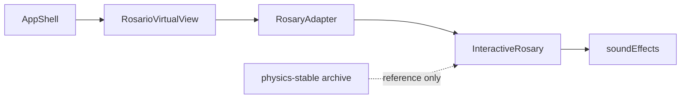

# Rosary UX Recovery — Jun 2026

**Branch:** `cloud-rosary-v2`  
**Pinned commit:** `44b014a` (update after next commit)  
**Date:** 2026-06-20/21

## Pinned snapshot — do not rewrite casually

| Field | Value |
|-------|-------|
| Stack | `RosarioVirtualView` → `RosaryAdapter` → `InteractiveRosary` |
| Visual | Looked alright — semi-transparent beads, readable prayer layer |
| Stability | No possessed jitter (vs `physics-stable` refactor path) |
| Drag | Beads draggable; rosary not anchored / falling |
| Structure | Topology appeared ok (master inline 60-bead graph) |
| Crash fixed | Heart medal tap → `playBeadCollision()` in `soundEffects.js` |
| Rule | Treat `InteractiveRosary.jsx` as sacred until v4 `buildRosaryEdges()` merge |

### Preserve these files

```
src/components/RosarioNube/RosaryAdapter.jsx
src/components/RosarioNube/InteractiveRosary.jsx
src/components/RosarioNube/InteractiveRosary.css
src/components/RosarioNube/hooks/useRosary*.js
src/components/RosarioNube/hooks/useBeadInteraction.js
src/components/RosarioNube/utils/mysteryColors.js
src/components/RosarioNube/VirtualRosaryPhysics.jsx
src/components/RosarioNube/VirtualRosaryPhysics.stable.jsx
src/components/RosarioNube/physics-stable/   (archive only)
src/utils/soundEffects.js
src/utils/prayerHistory.js
```

## Manual verification (appears fixed)
| Issue | Before (physics refactor) | After (InteractiveRosary restore) |
|-------|---------------------------|-----------------------------------|
| Jitter / possessed jiggle | Per-frame correction + tether caused shake | **Fixed** — master `MouseConstraint` + no correction pass |
| Beads not draggable / rosary anchored | Cursor-body constraint, weak feel | **Fixed** — bead drag + empty-space pan |
| Structure / topology wrong | Medal ports, lone-bead wiring bugs in refactor | **Ok** — master inline 60-bead graph; v4 canonical in archive |

## Active runtime stack



## Key source files

| File | Role |
|------|------|
| `src/components/Views/RosarioVirtualView.jsx` | Prayer layer + rosary z-index |
| `src/components/RosarioNube/RosaryAdapter.jsx` | Props bridge to InteractiveRosary |
| `src/components/RosarioNube/InteractiveRosary.jsx` | Matter.js, drag, afterRender glow |
| `src/utils/soundEffects.js` | Event chimes (lazy AudioContext) |
| `src/components/RosarioNube/VirtualRosaryPhysics.jsx` | Re-exports RosaryAdapter |
| `src/components/RosarioNube/VirtualRosaryPhysics.stable.jsx` | Archived shell |
| `src/components/RosarioNube/physics-stable/` | Archived jitter-free module |

## What was archived (keep for merge)

See [physics-stable-archive.md](./physics-stable-archive.md).

- No `beforeUpdate` position nudging (jitter source)
- `rosaryTopology.js` medal port left/right
- `getRosaryBeads()` 61-node liturgical mapping in `physicsRosaryData.js`

## Known bugs

| Bug | Status |
|-----|--------|
| `playBeadCollision is not a function` on heart medal tap (litany locked) | **Fixed** — method added to `soundEffects.js` |
| `areClosingPrayersUnlocked` not wired in RosaryAdapter | Open — heart bead logs only |
| Full `buildRosaryEdges()` merge into InteractiveRosary | Deferred |

## Deferred (Phase 2)

- RosaryCraftView (bead-by-bead builder)
- CosmicResonator organ as optional sound mode
- BookletView Matter integration (Booklet uses vitral only)

## Related docs

- [topology-current.md](./topology-current.md)
- [interaction-rules.md](./interaction-rules.md)
- [../architecture/current-stack-jun-2026.md](../architecture/current-stack-jun-2026.md)
